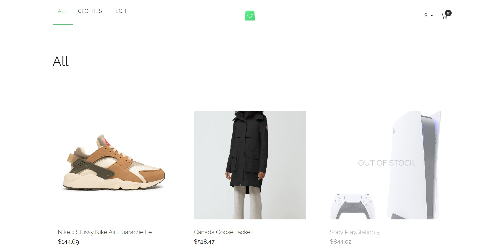

# Online shop

## Overview

The application is created on React with using TypeScript. I used [Apollo Client](https://github.com/apollographql/apollo-client), as GraphQL client, due to the wide settings, Reactive variables (modifying a reactive variable triggers an update of every active query that depends on that variable) and more widespread. Therefore, this makes it possible to create the application without the other state manager like Redux. So using Apollo Client gives opportunity For typing I generated types based on a GraphQL schema with help of [GraphQL-code-generator](https://github.com/dotansimha/graphql-code-generator).
It's styled using [Styled-Components](https://github.com/styled-components/styled-components) because of automatic critical CSS, easier deletion of CSS and simple dynamic styling.

_Data fetches from the GraphQL endpoint and to provide an interface to view and interact with this data. You can find the endpoint [here](https://github.com/scandiweb/junior-react-endpoint), along with instructions on how to launch it._

## Presentation

Click and watch ▶️

## Requirments

### Required:

- Only React;
- Class components;
- Create-react-app to scaffold the application.

### Allowed:

- State management libraries (e.g. Redux, Recoil);
- CSS-in-JS approach allowers (e.g. styled-components).

### Prohibited:

- UI libraries (e.g. Tailwind, Material UI, Ant Design);
- Functional components.

## App launch

### `preparing`

Clone the repository with the GraphQL endpoint from the link above and follow the steps there.

### `running`

Clone this repository and after the preparing run **npm install** and **npm start**.

## Summary

It was my first meeting with GraphQL and Apollo Client. To complete this assignment I read various documentation, articles and best practiсes. I haven't only met with new tools, but also I've improved my work with React and TypeScript. The most difficult was running of global state without a third-party state manager like Redux because I wanted to use only Apollo Client.
I'm glad I took part in this challenge because I enjoyed the time doing it. And hopefully I showed my skill level well.

I wanted to use experimental technology as typescript decorators to send a component necessary data through props personally. I couldn't figure out how to implement them to a component with typing but I think it could improve and simplify my code.
